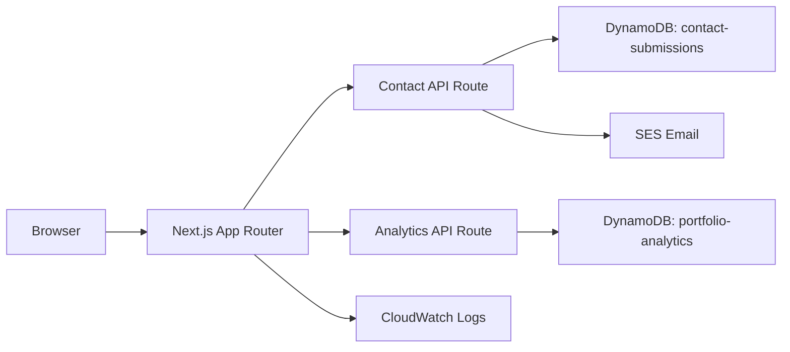

# Brian Walker Portfolio

A production-ready portfolio website built with Next.js, TypeScript, Tailwind CSS, and AWS services. The site includes a polished frontend, a validated contact API, and DynamoDB-backed analytics for resume downloads and project views.

## Architecture



## Features
- Responsive portfolio experience with dedicated pages for About, Projects, Skills, Contact, and an admin dashboard
- Validated contact submissions with Zod and rate limiting
- CloudWatch logging and AWS SDK v3 service clients
- DynamoDB-based analytics for resume downloads and project views
- Security headers, structured observability, and production-oriented API design
- Amplify-first deployment using IAM roles rather than static credentials

## Tech Stack
- Next.js 16
- React 19
- TypeScript
- Tailwind CSS
- Framer Motion
- AWS SDK v3
- Zod

## Local Development
```bash
npm install
npm run dev
```

## Deployment
1. Create an AWS Amplify app and connect this repository.
2. Set the build command to `npm run build`.
3. Configure the environment variables below in Amplify.
4. Attach an IAM role to the Amplify service with least-privilege access to DynamoDB, SES, and CloudWatch Logs.

## Environment Variables
```env
NEXT_PUBLIC_SITE_URL=https://your-domain.com
AWS_REGION=us-east-1
CONTACT_TABLE_NAME=contact-submissions
ANALYTICS_TABLE_NAME=portfolio-analytics
CONTACT_FROM_EMAIL=verified-sender@example.com
CONTACT_TO_EMAIL=your-email@example.com
CLOUDWATCH_LOG_GROUP=/aws/amplify/portfolio-site
ADMIN_USERNAME=admin
ADMIN_PASSWORD=replace-with-a-strong-secret
```

## AWS Resources
- DynamoDB tables for contact submissions and analytics
- SES verified sender and recipient addresses
- CloudWatch log group for request logging

## IAM Permissions
The Amplify execution role should allow:
- `dynamodb:PutItem`
- `ses:SendEmail`
- `logs:CreateLogStream`
- `logs:PutLogEvents`
